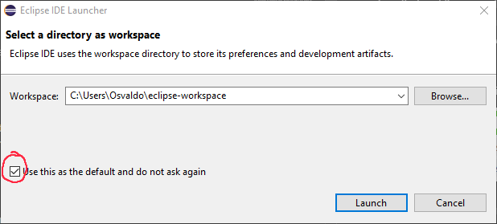
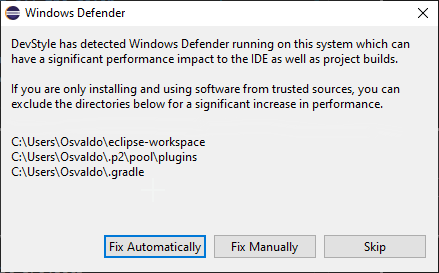
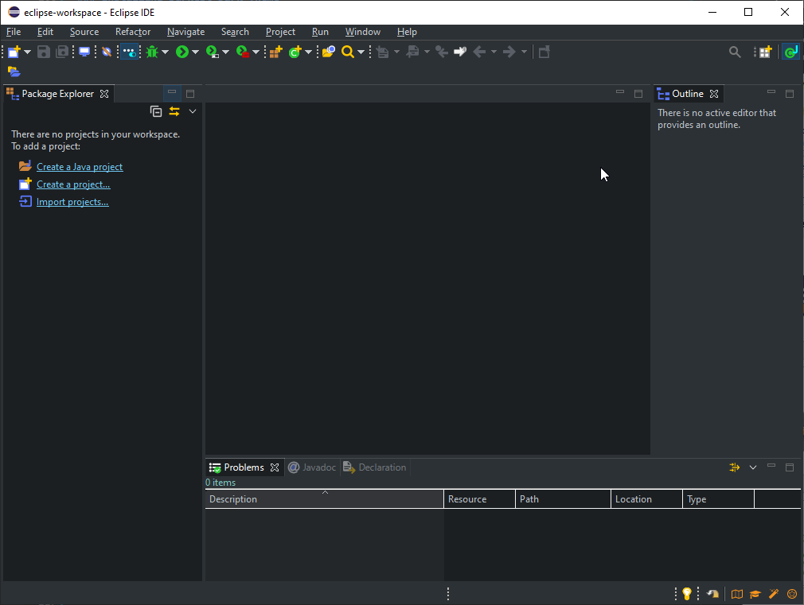
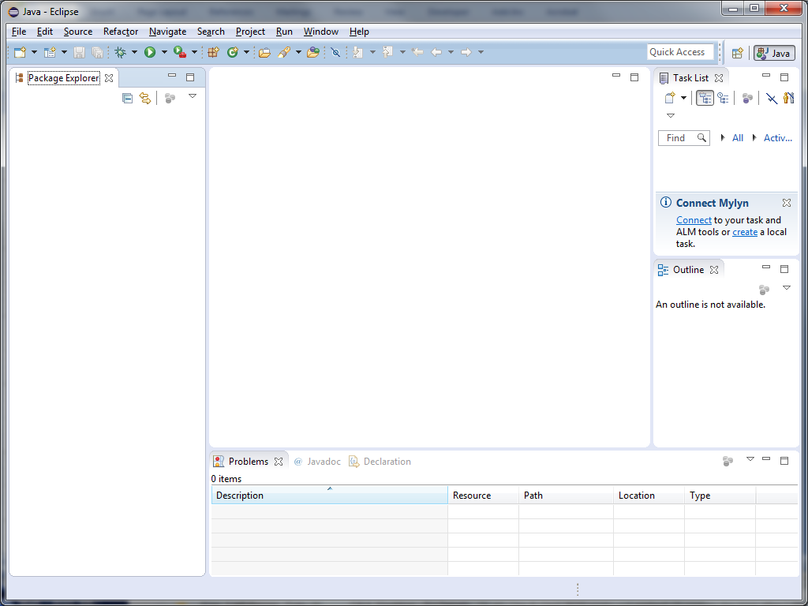
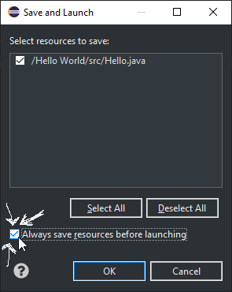
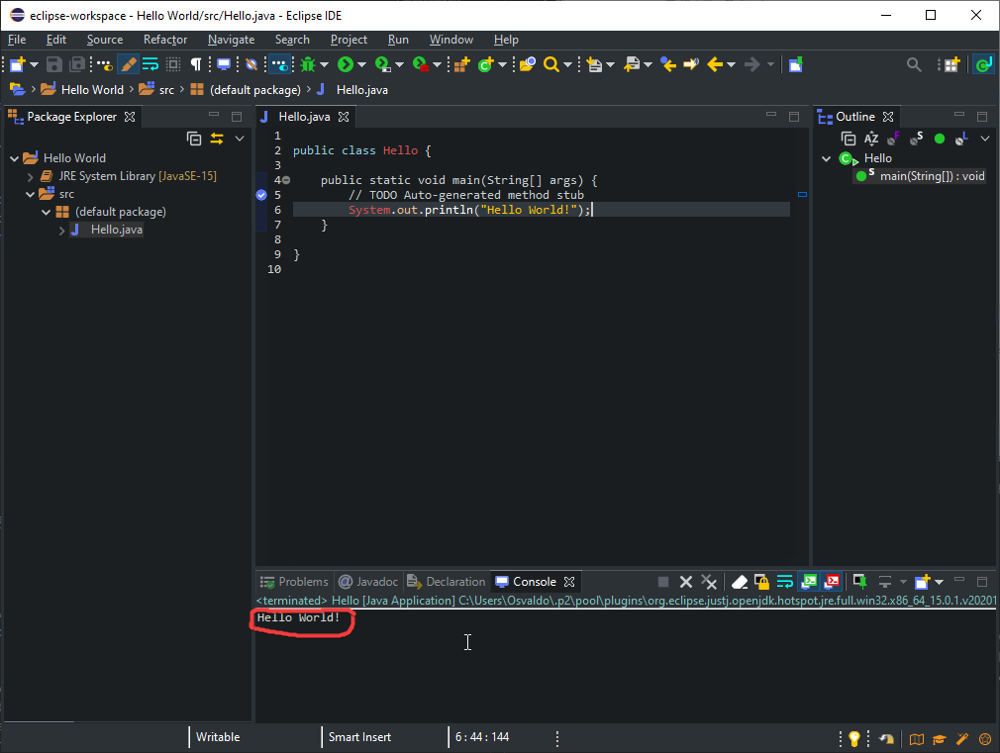
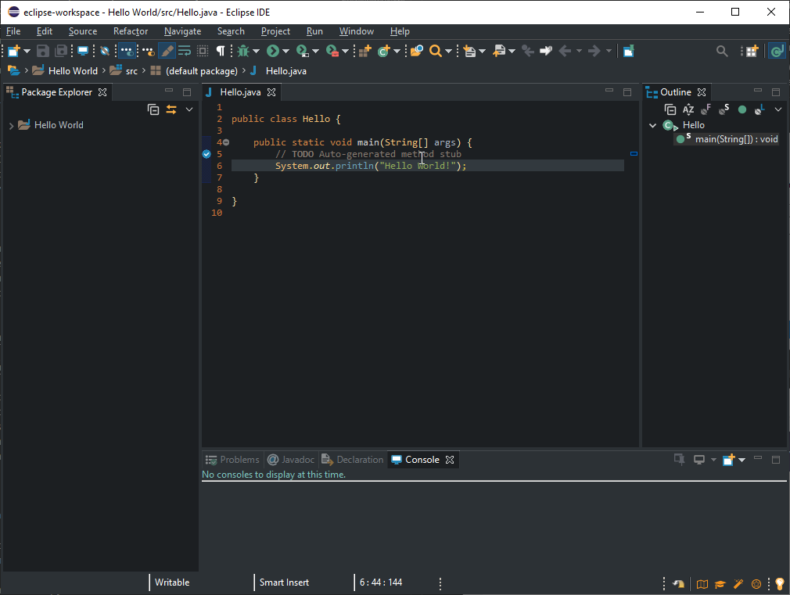

# Java and Eclipse Lab (Credit given if done by next class)

If you are using a school computer skip down to Step 5.

## STEP 1: Remove any previous installations of Java that you have

This class uses a very specific version of java, to
help us in getting certain elements done quickly and efficiently. In
order to remove any confusion, we're going to have you remove any
previous versions of java that you may have, so that they don't get used
when installing eclipse. You can do this by going to your add and remove
programs setting in windows, or applications on a mac, and searching for any java programs, and **remove them**.


## STEP 2: Download Eclipse

Go to the eclipse site: <http://www.eclipse.org/downloads>


Click the orange download 64 bit button. It will take you to another
page where you need to click the big orange download button again at the top.

Wait for that file to download.

## STEP 3: Run the Eclipse Installer

Once you double click the installer, you'll eventually be taken to a
screen that looks like this.


Click the top option on *Eclipse for Java Developers*. It will then ask you to specify
where you would like eclipse to be installed and live, as well as what JRE you'd like.  Stick to the JRE specified in the list, and pick an appropriate place. You can also
choose whether you want a start menu entry or desktop icon. After
clicking *Install* you can read the User Agreement or just click Accept
Now. If you click Decide Later it will just pop up later in the process.

Also, you may receive a warning about the process taking longer than usual, have no fear, just let it keep working.

Once it's finished installing, you'll then get a green *Launch* button.
Click it to start Eclipse.


## STEP 4: Get Familiar with and start Eclipse

Since this is your first time running eclipse here are a couple of
things you want to know.

*If you are using a school computer, make sure that you change the
workspace to a **Comp 55** folder inside of your **Documents** folder.*

When you double click eclipse, after seeing the splash screen you will
be greeted with the image below.

Eclipse likes to use the word **workspace** to mean the location where
you store all of your code. Think of it as the parent or base directory.
It breaks that directory or workspace down into **projects**, which is
the code you'd write for different assignments or different projects.
Each project gets its own directory, you can think of the project as the
solution from C++ or Visual Studio. Eclipse allows you to have
different workspaces and switch between them, which is why
it asks this question. Go ahead and pick the directory where you want
your projects to live on your hard drive. **Click
the checkbox to use as a default, and then click OK.**



Once clicked and Eclipse takes a bit to start up, Eclipse will then jump you to a
screen that looks something like this…


### Reviewing IDE configuration settings

Since all of you have had some previous experiences with other IDEs, Eclipse allows you to review some settings that depending on how you work you may want to change.  In case you are curious, these are the options that I ended up with at the end.


The next thing we are going to do is change eclipse's appearance.  I have been using eclipse for a long time now, and did not change this until this year.  Eclipse is written in Java and so it does not have as clean of an interface as some of the other programs that you have grown to love by now.  Nonetheless, remember, this is open source, it is used heavily in the industry (and I'm sure you've probably come across at least a few open source projects that just don't look as pretty but get the job done).  I would not play around too much with the colors, but I will walk you through this one option, because when we get to using some of the other features, and when we start building code, I will be using the skin here and so it will be easiest to follow along with tutorials and such if you change the appearance to match mine. **Please follow the options here to get full credit for the image you upload for credit at the end of this lab**

### OPTIONAL: If you prefer light theme, skip to step 6. 

You don't need to download from the Eclipse Marketplace if you prefer the default theme. 

## STEP 5: Installing Darkest Dark Theme

Once you are back you should be at the main page where we clicked to review the IDE preferences.  Go ahead and click to go the eclipse marketplace.  This will launch a variety of plugins and tools that have been developed to integrate into eclipse.  Here what we will do is download the darkest dark theme.  So search for "dark" in the marketplace and it should be the first option, which has 1.5M downloads, click install, and then confirm.  You'll have to accept another license agreement by picking the option before being able to finish.  **Be sure to uncheck the devstyle with codetogether bundle option, watch the video a few times** 


One it finishes installing, eclipse will ask you to restart eclipse to apply the software update, click **Restart Now**


Eclipse will close and start itself up again.  Once it finishes you'll be greeted with this screen.  


Go ahead and click next.  You'll then be presented with some options.  While your preferences are up to you, in order to match this website's color scheme and the labs, , I will be going with darkest dark theme in the middle (If I have a chance, I will probably change the theme even more.  That is a rabbit hole though, so I can show you how to do that later).  While you can change the color scheme to whatever you want, just know the icons and any future screens you see may differ a little bit from what I have.  **Please do not spend more than 10 minutes looking at all the color combinations**

Once you click next, you may get a scary looking screen about windows defender possibly getting angry with you about directories that Darkest dark will change and offers a fix.  I did just say *Fix Automatically*. (I'm not sure what happens if you click skip)



If you do allow it to fix automatically, you'll have to allow for elevated privileges from Genuitec LLC, which is the maker of Darkest Dark.  

Then eclipse will fire up with Darkest Dark one last time to ask you about your options.  I left all of this the same, except for checking the box "Show breadcrumbs", which just helps with navigation, then finish.  Once you do, you'll see the same launch screen as before, but if you picked the theme, you'll see some of the windows in a different color.


Go ahead and click hide, and you'll now be shown your new workspace.

.

If you didn't end up switching to this darkest dark theme, then your eclipse would look liook more like the image below.  This is from a previous version, so the windows open may be slightly different.



Eclipse describes the different panels that you have as **windows**.  The left window is called the package explorer, where you will have all of your projects listed, and the middle window will bring up your code. Eclipse is different than Visual
Studio in that when you start Eclipse, all of your projects will be
listed, which I think makes it easier for you to look at past projects
and explore other files you have written, in case you need to look back
at anything. I would encourage you to not think o

## STEP 6: Let's get a Hello World going.

To start programming in any language, it's best to start with a simple
thing like "Hello, world", so let's do that. Go ahead and right click on
*File-\>New-\>Java Project*. Java Projects are very similar to the
Solutions you had in Visual Studio. After clicking, you'll see a window
that looks like this…


Give your project a name *Hello World*, and then click **Finish**. They'll ask you if you want to create a module info, which you can ignore for now by clicking **Don't Create**.  You'll then see see a project named Hello World on the left in your package explorer.

Now, Right-click on the project name (HelloWorld) and then go to
*New-\>Class*, (this can also be accessed from the file menu
*File-\>New-\>Class*)

This takes you to a window with a lot of options that looks like this,
though this version has it populated with the options you want,
highlighted.


In Java, class files are where you will write your code. Rather than
having separate .h and .cpp files like in C++, Java just has one file,
the .java file, which are also referred to as **class** files.

Make sure that you select the options I highlight in the image, which
have eclipse write a little bit of code for you so that you don't waste
your brainpower on tangential tasks. Eclipse will make a main method for
you. We may go over other parts of this, but for right now, writing in
the name for the class and selecting the *public static void main*
option are the only two things you need to do before you click
**Finish**.

Once you do, you'll get the code at the end that you see in the image above.

## STEP 7: Write and Run

Notice that the file Hello.java is now your HelloWorld Project. That
file has also been opened in the editor, where it has a few words. ```public class Hello``` just lets
the computer know that you are creating a class. All java files are
class files; the name after ```public class``` must match the .java
filename. If you change it, (like we did below to say *Hello1*) you will
be greeted by a nice red squiggly. Hover over the squiggly to get the
quick fix popup shown below.


Notice the quick fixes…These are options you can click on to have
eclipse do little tasks for you, like change Hello1 back to Hello, or to
rename the java file as Hello1.java. Click on whichever you see fit.

Once you're done, inside your main, I want you to type.

```java
System.out.println("Hello, World!")
```

That is like the standard C++ ```cout``` statement, except you provide
```println``` a string. Eclipse may start giving you suggestions right away
and tell you that code recommenders is enabled, which is a nifty little
feature for later.

After typing the line, go ahead and right-click on your java file, and
head to *Run-as-\>Java application*, or you can just click the *Run*  in
the menu up top. The super handy keyboard shortcut here is
***Ctrl-F11.*** If you haven't saved, you'll get a popup asking if you
want to save like this, without the arrows but **make sure it is checked**



Again, here I would check the box at the bottom to always save resources
before launching, and click that you want it to save before running. If
you didn't get the popup, add an exclamation point to *Hello, World\!*
and then run it again without saving.  Please make sure that you follow these steps.  If I see that you haven't completed this step in the future, expect some scorn from me.

Once you click OK you'll get the console up and running, which will show
on the bottom of the screen.



Congrats you've written and run your first Java application\! Java
doesn't have a separate compile and run step like you did in C++, it's
all combined into one step.  Like I mentioned to you before, the whole colors thing is a big rabbit hole.  If you notice in the picture that I ran, the text that should be colored is not, which may happen.  That is ok.  Once you start editing it again it will re-apply the color scheme.  But in order to be completely in line with this class and the color theme, we are going to do one last set of steps.

## STEP 8 - One Last Customization to the Color Theme

If I get to this, I will try to make this match as much as possible the site, with a couple of added preferences to keep it in line with some of the things that I've seen with Eclipse.  So to that end, I'd like you to **[download this file](lab1media/media/COMP55LabColorScheme.xml)** which you'll have to do by right clicking and saying *File->Save link as...* Make sure you have the XML extension when you save the file.  

Then once you have that, you're going to go to *Window->preferences->DevStyle->Color Themes*.  Once there I made two changes.  I decided I wanted my icons to be a little bit more subdued, so I went with the pastels option.  More importantly though let's get the color scheme to be closer to the theme here on this site.  Simply choose the xml file you downloaded and then click apply.  Eclipse will ask to restart and once you do, you'll notice that the colors changed and have the same style as the final ones in the static image below.




While you are in those preferences, there is also a devstyle privacy option that should you wish, you can opt out of.  I will only be supporting these colors, so in the future all guides will be using darkstyle with this xml layout and the pastel icons.  If you wish to go with another scheme, I will not answer any questions about where those icons are.  Please again, I can't stress this enough, do not spend more time trying to pick colors now.  You can do that at the end once you are finished with traffic jam.

# STEP 9 – Submit confirmation by uploading a picture to Canvas

To get credit for this lab, what you'll do is submit an image of you
running this hello world program to canvas, but using your own name
instead. The image should be of the program, similar to the one in the image above. To get full credit however, **use a for loop, make sure the
java file is showing and have the for loop repeat the salutation three
times**. So it would be something like

```

Hello, PutYourName Here!

Hello, PutYourName Here!

Hello, PutYourName Here!

```

But with your own name there instead.

If you don't remember how to do a ```for``` loop, here's a snippet from
Princeton's java cheatsheet.[   ]

(<http://introcs.cs.princeton.edu/java/11cheatsheet/>)


Also, if you're not sure how to get an image, use the **Snipping tool** or **Snip & Sketch**
for windows (Search for it in your windows menu). If you're on a mac,
key in: *⌘ + Shift + 4*. Or just google "take screenshot window mac" and
the instructions will come up.

I encourage you at this point to try to work on some of the coding bat
problems or other work that you've done before to get them to work in
java. Try to make some functions, declare an array, etc. You'll notice
all of those things are very similar to what you've done before.
Unfortunately there is no equivalent to ```cin``` in Java that is as simple
and easy to use, but we'll talk about how to get some additional
interactivity in the future.
