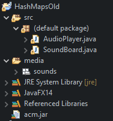
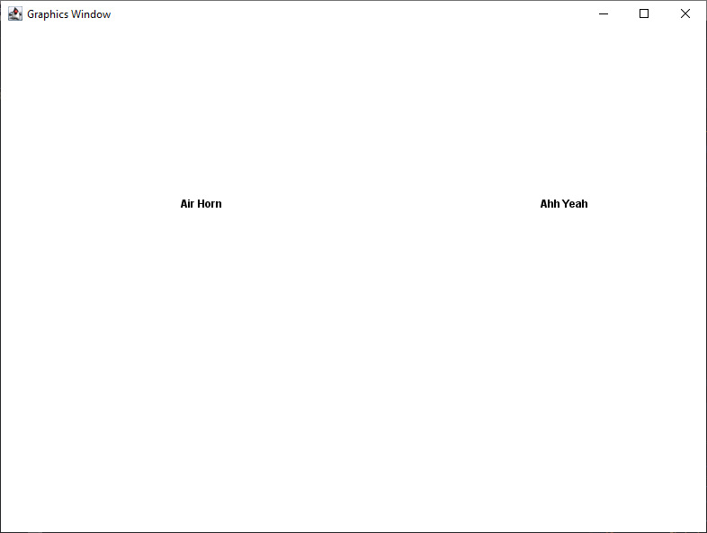

# Part 2 of the HashMap lab

If you didn't read part 1 of the HashMaps lab, realize there are some puntos involved with that lab, so [go back to that lab](12-Hash.html) before continuing.

[**Click here to start this part of the lab**](http://go.djosv.com/hashmap) and clone
the repository into eclipse, [just like you've done](lab8media/media/importrepo.gif) before in [the other
labs](lab8media/media/importfromgit.gif). 

You will know that you are finished when you have in your repo something that looks like this: 

## Quick detour on Gradle

**Make sure that your project folder looks like this** -  - 
notice the icon in the upper left.  That is something new that our projects will have from now on that introduce us to **gradle**, which is an industry tool made for helping folks with a variety of issues that occur with building projects.  We'll use it to help us manage additional libraries that you will need for your projects.  Using it will cause the project structure to change a little bit.

Here's how the structure looks differently.

| old   |  new   |
| :-- | :-- |
| | |

If you notice, most things are the same.  What we are gaining by using gradle is a way to automatically install particular libraries.  Remember how at the beginning of the semester I had you jump through a bunch of hoops to install eclipse and change settings here, or there, and some of you have also had to work to fix your java build path for example?  **With gradle all of this is taken care of**.  Instead of fiddling with your buildpath in eclipse, gradle uses a file called ```build.gradle``` that allows us to provide directions on what libraries are needed to build the project and we could provide additional instructions on how to get the project to run.  For this lab and from here on out we need a library called **JavaFX**, and so instead of having you go to a URL and download it and then edit your eclipse environment and crossing your fingers that you downloaded the correct one, ***gradle takes care of downloading it and installing it for you***.  All we need to is to start following some of their conventions.  For one, we will use this pattern of src/main/java to put our files into, and we will name packages which is good practice anyways.  Packages are just folders where we group java files that have something in common, similar to how you would use a directory to place files that make sense to go together.

## Let's get this party started

What we are going to build today is an accessory that is a
very 🙃 *essential* 😏 part of a DJ set 🙄. We are
going create a very simple **Sampler**, aka a
**SoundBoard**, where we will create a couple of different ```GLabel```s and
we are going to play sound effects when each of those different
 ```GLabel```s are clicked. If this doesn't at all make sense, it will once
you start hearing the sounds, as they will make you reminisce about those days at a party ✨🎉✨. To start you off, you'll have two classes,
1. ```SoundBoard```, which is a ```GraphicsProgram``` skeleton with a
```statusLabel```
2. ```AudioPlayer```, which is a pretty nifty class that
you'll be able to use to play mp3's. All you'll need to do is to call
the AudioPlayer variable (in ```SoundBoard```, it's called ```player```) and
call the method ```playSound```. ```playSound``` takes in two arguments, a
*folder*, and an *mp3*. While you don't have to look too deeply in
```AudioPlayer```, if you do decide to open it up, you'll notice that
```AudioPlayer``` does in fact contain a ```HashMap``` that links a ```String``` (in
this case, a *filename*), to a ```MediaPlayer``` object.

The basic goal of extending the ```SoundBoard``` is to add two ```GLabel```s
and then when each of those ```GLabel```s is clicked, to play a particular
sound effect. While we could create the labels
and then have a gigantic ```if``` statement at the bottom that would try to
link a label to a sound, let's leverage using a ```HashMap``` instead. In
order to help us with this, let's first create an interface. **After
each step, please commit your changes with a short comment as to what
you did in the commit message.**

## Steps to take
Make sure you commit the changes as you go through.  To help you in making sure
you are following along with the labs, tests have been provided to help you ensure
that what you are doing is in fact correct.  You can run these tests either in eclipse by opening up the src/test/folder, or by pushing your code.

1. Create an interface called **Playable** and insert the following two
    methods inside.

```java
public void play(AudioPlayer player, GLabel statusLabel);
public String getName();
```

[Remember that interfaces](7-Interface.html) allow us to create some objects that are much
more flexible. In this case we want to create an interface that allows
someone to just implement these two methods. One where we ask for a
string that gives us back a name, and the other which provides us with a
```AudioPlayer``` and a ```GLabel```, and we are asked to play a sound.  Remember to use ***Ctrl-Shift-O*** to organize any imports (like ```GLabel```).  You can commit and push your code, or you can also run your code by opening up the step1Test, like we have here.

# Insert an image where you run the test.

2. Create a **SoundEffect** class that **implements Playable**

As part of this class, you'll need to have a constructor, as well as to
implement the two methods, ```play``` and ```getName```, which you should use
override for. Create a private ```String``` instance variable that you call
```name```. This will allow you to simply return that name for the ```getName```
method that ```Playable``` asks you to implement. To get this name, in the
constructor, just have a parameter that is a string that gets passed
into the constructor, so that you have something like this:

```java
public SoundEffect(String n) {
    name = n;
}
```
By this point, your code should be able to pass the first and second set of tests.

3. In the play method for ```SoundEffect```, fill out the ```playSound``` method, by
    using the ```AudioPlayer```. If you use the same ```player``` variable, this
    could be started as by adding this line into the ```play``` method.

```java
player.playSound("sounds", name + ".mp3");
```

```AudioPlayer``` also has a ```stopSound``` method, which works just like ```playSound``` and will use the same arguments.  **You will want to make sure that you call ```stopSound``` before ```playSound```.**  You should also call ```setLabel``` on the label itself to update what it is
playing, which **needs to have exactly** ```"playing: " + name``` as
the text inside the call to ```setLabel``` for the ```GLabel``` passed into
```play```. At this point your ```SoundEffect``` should not have any errors and
you should have three methods that have code implemented. A constructor,
a ```play``` method, and a ```getName```.  Here the test provided will only test that the label is updated correctly.

4. Declare a ```HashMap``` instance variable in ```SoundBoard``` that links a
    ```GLabel``` to a ```Playable``` and initialize it in the ```run``` method. If it doesn't recognize HashMap, amke sure you ```import java.util.*;``` or do ***Ctrl-Shift-O***.  In
    this case **a ```GLabel``` will be the key and the ```Playable``` will be
    the value**. Are you not sure how to be able to declare and initialize a ```HashMap```?
    If you aren't sure, then you'll want to go back and [look over the lab](12-Hash.html)
    more closely. In this step, you are only creating the ```HashMap``` (~2 lines of code), you
    will link items in Step 6, so there is no test per se, just check you have added two lines of code and then move to the next step.

5. In ```SoundBoard```'s ```run```, create ```GLabel```s for both the ```AHH_YEAH```
    and the ```AIR_HORN```. Use the constants around lines 18-25 to give you the x and y coordinates, names, and the font string to set each label's names, coordinates and font. Make sure you use the same string constant to **create a ```SoundEffect```
    object in run too**. All in all you are making two ```GLabel```s, and two ```SoundEffect```s using only constants as the parameters.  When you run this program, you should get something that looks like the picture below, but nothing will happen just yet. (~8 lines of code)

    

6. Near the end of ```run```, use the ```Hashmap``` that you created to link the ```GLabel``` key with the
    ```Playable``` object. Remember since ```SoundEffect``` is a ```Playable```
    object, you'll actually *link* the ```GLabel``` *with* a ```SoundEffect```.  Again, if you are not sure how to do this, [go back and look over the lab](12-Hash.html##basic-hashmap-usage)

7)  In ```SoundBoard```, finish implementing the ```mousePressed``` method,
    which should leverage the ```elem``` from ```getElementAt```. Inside the
    ```if``` statement where you are checking to make sure that ```elem``` is in
    fact a ```GLabel```, you can then get the ```SoundEffect``` from the
    ```HashMap``` and then just play it. Test it to make sure it does in fact play the
    sound and voila\! You are now one step closer to err...something. (~4 lines of code)

# Bonus

In class, you'll notice that I showed an explosion where the label
shakes up and down, (if I haven't shown you this, please ask me to\!).
To implement this correctly, think about making a new class called
```Explosion``` that inherits from ```SoundEffect```. You should also create a
class ```LabelShaker``` that has a ```GLabel``` as an instance variable and that
```implements ActionListener```. Then, in the ```play``` implementation,  start the ```Timer```
to move the label up and down, which uses the same mechanics from the
dance simulator for moving the label back and forth on each call to
```actionPerformed```.
