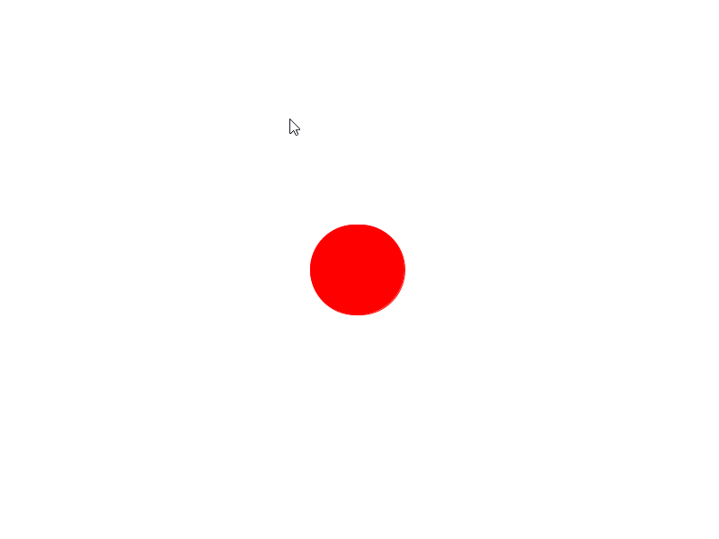
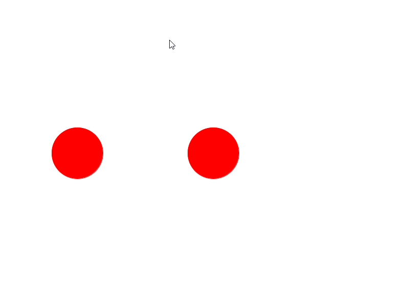

# ArrayLists

- [Pre-requisites](#pre-requisites)
- [Introduction](#introduction)
- [**Completing this mini-lab**](#completing-this-mini-lab)
- [**Making all balls move**](#making-all-balls-move)
- [**Bonus: What? The balls don't move independently?! I gotta make them all bounce around the screen!!!**](#bonus-what-the-balls-dont-move-independently-i-gotta-make-them-all-bounce-around-the-screen)

## Pre-requisites

**Before working on this lab,
you'll need to make sure that you finish at least the
[Ball portion of the interactivity lab](5-Interact.html),
so that when you run that file,
you are able to do this:**


If your program has not gotten to that stage,
please [go back](5-Interact.html) and get there first.
You've been warned.

---

## Introduction

```ArrayList``` is a special Java collection that makes keeping track of multiple items
(what we normally use Arrays for)
much *MUCH* easier.
```ArrayList```s are similar to ```Vector``` in C++ in that they:

- Don't have some absolute size limit like arrays,
  they just keep growing as you add more items.
- Can add items to the end of an array by simply calling ```add```
  along with the item to be added.
- Can ```insert``` items into the middle of the list
  without worrying about whether or not you shifted all the elements over.
- Can ```remove``` items from the list in a variety of ways
  either searching for the object to remove or removing at a particular position.
- The list will automatically shrink when items are removed.
- Can cycle through the ```ArrayList``` in a very shorthand and awesome way.

```ArrayList```s do have an array under the hood,
and so we can still access them like arrays,
except instead of using the bracket notation we use *```get```* and *```set```* methods.
In order to use ArrayLists,
you'll need to ```import java.util.*;```
which is the package that has the ArrayList code.

What's the catch?
Well, one drawback is the additional syntax.
You have seen this syntax before in C++,
which is specifying the type of ArrayLists by using *angle brackets* ```<>```.
So to make an ```ArrayList``` of type ```String```,
you would do:

```java
ArrayList<String> ids = new ArrayList<String>();
```

This would create an empty list called ```ids``` that can hold Strings.
If you wanted that list to hold ```GOval```s instead,
you would have to change the type inside the angle brackets to be a ```GOval``` on both ends.

The other drawback is that they don't work directly with primitives like ```int``` and ```double```.
## Understanding ArrayList and Primitive Types

One notable limitation of `ArrayList` is its inability to directly handle primitive data types such as `int` and `double`. This is because `ArrayList`, like other collections in Java, is designed to work with objects, not primitives. To store primitive values in an `ArrayList`, Java provides wrapper classes (e.g., `Integer` for `int`, `Double` for `double`) that encapsulate primitive values as objects. Java's autoboxing feature automatically converts a primitive value to its corresponding wrapper class when added to an `ArrayList`. Conversely, unboxing automatically extracts the primitive value from its wrapper when retrieved.

For example, to store integers in an `ArrayList`, you would declare it as `ArrayList<Integer>`, and Java takes care of converting `int` values to `Integer` objects upon addition to the list. This seamless conversion between primitives and their corresponding wrapper classes allows for the flexible use of collections with primitive types.

### Example Code Demonstrating Autoboxing and Unboxing

```java
import java.util.ArrayList;

public class AutoboxingExample {
    public static void main(String[] args) {
        // Create an ArrayList to store Integer objects
        ArrayList<Integer> list = new ArrayList<Integer>();

        // Autoboxing: Java compiler automatically converts the primitive int to an Integer object
        int number = 10;
        list.add(number); // 'number' is a primitive int that gets autoboxed to an Integer object

        // Accessing the Integer object
        Integer retrievedNumber = list.get(0);

        // Unboxing: The Integer object is automatically converted back to a primitive int
        int primitiveNumber = retrievedNumber;

        System.out.println("The number in the list is: " + primitiveNumber);
    }
}
```

For a more in-depth understanding of autoboxing and unboxing in Java, refer to this comprehensive guide: [Autoboxing and Unboxing](https://docs.oracle.com/javase/tutorial/java/data/autoboxing.html).

These are not really needed for the assignment though,
so if you'd like to learn more,
you can go off and learn about them on your own.
You may also need them for the bonus section.

Here's some code to show you how awesome ```ArrayList```s are.
This presents most of the functionality that you will need for the project.
This will do what you expect,
including the printing of the names.
If you want more information on the different methods that you can call on an ```ArrayList```,
you can visit the java documentation (aka *javadoc*)
by googling **"java arraylist api"**
which should take you to a site like this

<https://docs.oracle.com/en/java/javase/11/docs/api/java.base/java/util/ArrayList.html>

Here is some sample ArrayList code.

```java
void foo() {
    ArrayList<String> names = new ArrayList<String>();
    names.add("Osvaldo");
    names.add("David");
    printList(names);
    names.remove("Osvaldo");
    printList(names);
}

void printList(ArrayList<String> list) {
    for(String s:list) {
        System.out.println(s);
    }
}
```

For more in-dpeth information about the differences between Arrays and ArrayLists, [click here](https://www.w3schools.blog/difference-between-array-and-arraylist-in-java).

## **Completing this mini-lab**

To complete this lab,
you are going to copy your **Ball.java**
file from the Interactivity lab and paste it in that same project
(*Make sure to cover the Ball portion of the Interactivity Lab before attempting this lab*).
You can rename the file **Balls.java**,
since your end goal will be to have multiple balls bouncing off the screen.

**If you decide to copy and paste the code into another project,
you should make sure to change the ```main``` method at the bottom,
which should change from**
```newBall().start()``` **to** ```new Balls().start()```.
**You should also delete all mouse handlers except**  
```mousePressed```.

You'll also have the program change a single ball's color when that particular ball is picked.
Let's start by introducing a constant in your file ```NUM_BALLS```
that will store 2.

Go ahead and place this value as a constant before your instance variable declarations

```java
public static final int NUM_BALLS = 2;
```

Then declare an instance variable that will store an **```ArrayList```** of **```GOval```s**,
and call that variable **```balls```**.
Next at the beginning of ```run()```,
create the ```ArrayList``` object by saying:

```java
balls = new ArrayList<GOval>();
```

Then, you will change the code where you created your original ```GOval``` ball,
and surround those four lines
(*including the* ```add(ball)```)
in a ```for``` loop that repeats ```NUM_BALLS``` times.
In addition to adding the ball to the screen,
you'll need to add the ball to the list.
***This means that after* ```add(ball)``` *you should write* ```balls.add(ball);```**
which will add the ```ball``` to your list of ```balls```.

Go ahead and *run the code* right now,
and notice how it looks the same initially.
However, as you let the program run,
you'll notice what looks to be one ball that is still and another that is moving.
So it should look something like this:



Because we have an ArrayList,
we looped through to create the balls,
*but we did not loop through to create the balls in different places*,
as each time through the loop we are giving the ovals the same coordinates to start at,
which simply puts them on top of each other.

An easy way to solve this is to change the ```x``` when the new ```GOval``` is created

from:

- ```WINDOW_WIDTH/2 –BALL_SIZE/2```

to:

- ```(i*(WINDOW_WIDTH/3)) – BALL_SIZE/2```

*If you wanted to have a general solution,
you would replace the ```3``` in the previous line with ```NUM_BALLS + 1```*.
Then we need to have the ```for``` loop start at one and go to three
(which is ```NUM_BALLS + 1```).
By doing this,
it would place the first ball at 1/3 of the width of the window
and the second ball and 2/3 of the width of the window.
Run the program again and the two balls should now start at different positions.
However, only one ball is moving and eventually for a little bit they overlap.
If we make all balls move however now that they are spread out,
we won't have them overlap anymore.

## **Making all balls move**

Just like you did in creating multiple GOvals,
the trick with making all the balls move is to go through the list and call ```move``` on each one.
You can do this
**by surrounding the code that moves ```ball``` and changes the direction inside of a for loop**.
Because it's very common to iterate through a list,
Java has provided an alternate loop syntax for cycling through a list.

```java
for(Elem e:list) {
    // Do something with e here
```

Where ```Elem``` is the **type**,
```e``` is the name of the variable for that type and ```list``` is the variable name of the list.

In our case, you would write:

```for(GOval ball:balls)```,

which would now allow you to reference each oval in that list and call it ```ball```
**while inside the** ```for``` **loop**.
Because we have redeclared ball,
notice that it is no longer blue,
(*we created a local variable with the same name
so that we wouldn't have to modify our existing code*).

To be sure you understand what is happening,
the above for loop is equivalent to writing this:

```java
for(int i = 0; i < balls.size(); i++) {
    GOval ball = balls.get(i);
    // Do something with ball here
```

You can also surround your ```mousePressed``` code with the same type of for loop,
so that you change the color of the ball that you clicked on.
One thing to know about the simplified version of the for loop is that you
**cannot use remove elements from the list while iterating through it.**
Doing so would raise an exception,
so if you are at all confused,
you can always go back to using the standard ```for``` loop syntax shown above
to iterate through a list instead.

Lastly,
let's make sure that we convert all the code
from working on the instance variable ```ball``` to the arraylist of ```balls```.
We should delete or remove the instance variable ```private GOval ball;```.
Once you do that,
you may notice other errors that pop up.
Those should be indications of places where you should work with the local variable.
For example,
one such error that you should come in is from outOfBounds()

When you run the program,
you'll notice that the balls are all moving in the same direction and don't work independently.
It should look something like the image below.



That is all you need for this mini-lab.
When that is done,
you can follow the directions that are outlined on the canvas submission page.
Just copy and paste the code into the editor into the canvas submission page for Balls.java.

## **Bonus: What? The balls don't move independently?! I gotta make them all bounce around the screen!!!**

Well that's outside of the scope of learning about Arraylists for this lab.
But to get each one to bounce around the screen,
that means that each ball will need its own ```xVelocity``` and ```yVelocity```.
One way to ensure that is to create a ```Ball```
class so that each ball can store its own ```x``` and ```y```
velocity as well as a ```GOval```,
but for this lab,
you could just make a parallel ```ArrayList``` for ```xVelocities```
and another parallel ```ArrayList``` for ```yVelocities```.
Doing so would probably mean
that you would want to use the more generalized version of the ```for```
loop that uses an ```i``` variable,
so that you can use the same index (```i```)
to link a particular ```GOval``` with an ```xVelocity``` and ```yVelocity``` if you'd want.
If you do this while passing in a ```Goval```
into ```outOfBounds``` called ```ball```,
then you should be good to go.
You can also have them move in random locations by using a ```RandomGenerator```.
This is the same as you have in this lab for asking for colors,
but instead we'll use a method called ```nextInt(low, high)```
to generate a random number between a low and high.
This random generation could be used for the x and y velocity for each ball.
Let me know if you have any questions.

Good luck!
