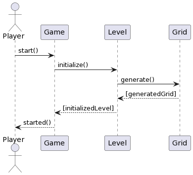

# Sequence Diagram Mini-Lab

For today's lab, we are going to learn about the sequence diagram,
which is also part of the UML standard.
Sequence diagrams allow us to think more about how objects are dynamically related to each other
or more succinctly,
sequence diagrams tell us who called what and when.

- [plantUML Starter](#plantuml-starter)
- [Sequence Diagram basics](#sequence-diagram-basics)
    - [Actors and Participant Objects](#actors-and-participant-objects)
    - [Creating the sequence via connection arrows](#creating-the-sequence-via-connection-arrows)
    - [Returning values](#returning-values)
- [Fancy options](#fancy-options)
- [Getting credit](#getting-credit)

## plantUML Starter

We are going to continue using [plantUML](https://plantuml.com),
as it's continued to serve us well.
Open up the online server and you'll see that we already have a sequence diagram to begin,
but we'll work just like we have before.

## Sequence Diagram basics

### Actors and Participant Objects

To start a sequence diagram,
we'll use some of the basics that we had before to declare the actors and the classes.
In plantUML actors will be represented using the same format:

```plantuml
Actor NameToAppear as varname
```

To start **create a player actor** on the screen.
In addition to actors,
we'll also need to lay out the classes
that will be interacting with each other based on what the actor is doing.
Each one of these classes will be labeled
with the keyword ```Participant``` instead of ```Actor```.
**Create three classes (Ahem Participants) called ```GraphicsProgram```,
```Level``` and ```Board```.**

### Creating the sequence via connection arrows

The magic in a sequence diagram is in the order
in which you now detail your connections
between the objects which are the actors and the participants.
This can be done by following this format.

```plantuml
Obj1 -> Obj2 : messageToAppear
```

Place each of these statements in the order that the sequence would go in.
The Obj can be the same object,
which would just create something that would point to itself.
Also,
messages from actors to classes can be in English,
but I expect you to use the proper names when making calls between participants.

Most of the time when we are establishing these connections between participants (aka classes),
we should make the following assumptions in such a model.

```plantuml
Obj1 -> Obj2 : Message
```

1. Obj1 has access to Obj2,
typically via an instance variable
1. The Message included is a method that is present in Obj2

### Returning values

In sequence diagrams,
if a method returns a value,
we generally show this by adding a second hyphen (to the arrow) to the connection.
This will change the line style from a solid line to a dashed one,
which helps refer to it as something that is being sent back.

Another thing that I like to do
is to use italics for any message
that details what is being returned.
I tend to place this into brackets,
but that is not needed.
But I do expect messages to be italicized,
which can be done by enclosing the message with:
```<i>``` and ```</i>```,
like so.

```plantuml
Obj2-->Obj1 : <i>[returnedObject]</i>
```

**Ensure that you have at least one return statement
that would make sense from one of the method calls you created previously**.

## Example Sequence Diagram Code in PlantUML

```plantuml
@startuml
actor Player as player

participant Game as game
participant Level as level
participant Grid as grid

player -> game: start()

game -> level: initialize()
level -> grid: generate()
grid --> level: [generatedGrid]
level --> game: [initializedLevel]
game --> player: started()
@enduml
```

The following code represents the sequence of interactions between a player, 
game, level, and grid components when the player initiates the game, including 
initialization and what gets returned between these components. 
(Layout structure is similar to the trafic jam made in COMP 055)



## Fancy options

Lastly,
make sure that you look at the various options in the documentation
for styling the diagrams as you wish,
as there are many
[awesome options in the PlahtUML docs](https://plantuml.com/sequence-diagram).
We won't cover them here,
but the most popular for sequence diagrams
is to group certain calls from classes with one another using alt or else.
**Search the documentation in plantUML to learn how to write this**.
Having an ```alt``` or ```else``` as an alternate path
is sometimes convenient for thinking about some alternate path
that could arise in the interaction,
but I tend not to use them too much
because then we get into this idea of having lots of logic in our sequence diagrams,
which then makes it more difficult to understand.

## Getting credit

To get credit for this lab,
make sure that you have an actor,
the three classes,
as well as the messages that go from each of the different classes,
as well as a return statement to help move this forward.

Instead of having ```Player``` be the name of your Actor,
**use your own name instead**.
