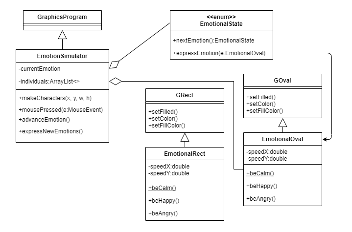
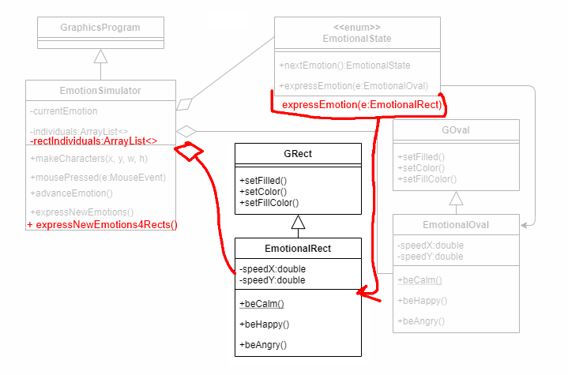
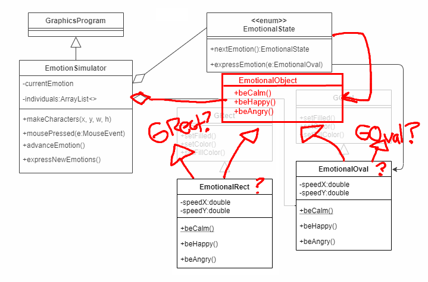

# Interface Lab

## Why Interfaces?
The purpose of this lab is to introduce you to interfaces, which is a
neat way to be able to use some of the benefits of polymorphism without
having the headaches of inheritance. While inheritance has its uses, one
of its biggest disadvantages comes when you want to borrow multiple
abilities from different classes. Java only supports inheriting from a
single class, while other languages that support multiple inheritance
often have some clunky constructs to help determine what to inherit from
which object. For example, if you wanted to create a ```ToyGuitar``` Class
that inherited from both ```Toy``` and ```Guitar``` and they both have a
variable called ```timesPlayed```.  However:
- In ```Toy```, ```timesPlayed``` is counting the \# of times the
toy has been switched on while
- In ```Guitar```, ```timesPlayed``` is counting the \# of times
*Stairway to Heaven* has been performed


<br>
*Source: [Giphy](https://giphy.com/gifs/fxLuTQsx3zQKk/media)*

In this case, which version of ```timesPlayed``` should
```ToyGuitar``` inherit or modify when you reference ```ToyGuitar```? This can
become messy and quite buggy. However, one thing that that Java has
realized is that you should be able to *inherit* multiple sets of
behaviors. This is where interfaces come in. **Interfaces** are special
java files that allow us to declare methods, *but provide no
functionality for those methods*. Java allows classes to implement as
many interfaces as they like, which will become useful when you want to
tie two classes together in a more flexible way.

## Working on our Simulator for this lab
Let's start by downloading the **InterfacesLab.zip** file, which you can do
from canvas or [directly from here](http://go.djosv.com/interface)

Import that zip file [like you normally would](lab2media/media/image2.gif).

In today's lab, what we are going to do is simulate the typical programming process, and so we are going to create an office programming simulator.  The goal of the simulator is to display the three most common emotional states in programming.  I would say that these three emotional states often happen in this particular order:

Before you beging programming there may be a sense of calmness or possibly a neutral feeling.  That calmness then changes to happiness as we are being productive and writing
code that we think will work.  That happiness then changes to anger/frustration when we encounter a bug.  Once we fix the bug, then we return back to being
calm, which lets us write more code and the cycle repeats.  Our program will be responsible for showing different graphical representations for each of these different states.

Let's talk about the program in its current state, which has three files.  

- ```EmotionalState``` is an enum class that has a couple of methods that will help us transition between our three states, ```CALM```, ```HAPPY```, and ```ANGRY```.  It also has a couple of helper methods that will help us launch particular pieces of information, such as cycling to get the next emotion (```nextEmotion```) and calling the appropriate method to express a particular emotion (```expressEmotion```).
- ```EmotionalOval``` is a subclass of ```GOval``` that adds two parameters for speed (we'll ignore them for now).  More importantly, ```EmotionalOval``` implements *three* methods that are in a way associated with the emotional state, which are ```beCalm()```, ```beHappy()```, and ```beAngry()```.
- ```EmotionSimulator``` is the main starting point for this lab.  It's a graphical program where we are creating an ```EmotionalOval```, and adding mouse listeners so that when the user clicks in the simulator the program will move to the next emotion for everyone in the simulator and have them express that new emotion.  

Here's what the standard UML diagram would be for how this class looks initially.


Currently when you run the program, you'll notice that the program goes through a few different stages.  For the purposes of this lab, we will assume that everyone goes through the same emotional states at the same time.  So once the user opens the application, all entities are in a *calm* state.  When the user clicks on the screen all of the individuals that are on the screen will change their state.  Here is the sample sequence diagram for how this interaction would play out:


In this lab, we want to add more objections that show emotion so that they are displayed on the screen when the user clicks on the mouse.  Currently, all we have is a single ```EmotionalOval```.  While we could try to add a second EmotionalOval or three or four, having just a bunch of emotional ovals that do the exact same thing isn't that exciting.  Let's introduce a new class called an ```EmotionalRect```.  One thing you may be tempted to do is just copy and paste ```EmotionalOval```.  I will look away from your screen while you do so 👀.

Once you copied ```EmotionalOval``` and renamed it to ```EmotionalRect```, let's go ahead and edit the new file to have it extend ```GRect``` instead of ```GOval```, which is on line 5.  So at this point our UML may look like this.  



If this is the case, then we have to think about how we are going to connect this GRect with the rest of our program?  One solution is just to keep copying and pasting like we already did (and I looked away from 🙈), and copy and paste things like expressNewEmotions, introduce a new method in EmotionalState for expressEmotion specifically tied to EmotionalRects, as well as have a new ArrayList for EmotionalRects.  This is what the new potential diagram would look like.  



While that may sound ok, what if we wanted to have another different emotional being?  It sounds like a lot of copying and pasting, and we are better people that that.  We don't want to harm anyone.  So another solution would be to perhaps not have EmotionalRect and EmotionalOval subclass from GRect and GOval, but maybe instead from an EmotionalObject.  Then we could change all of our instances from EmotionalOval to EmotionalObjects and then still potentially make it work?  So here is a UML of that proposition.


The problem with such an approach is that if we have both now subclass off of EmotionalObject, how will they get the properties of GOval and GRect, and how will we be add them on the screen and call all the wonderful methods we want to use like setColor and such?  There has to be a better way.  

## Introducing the Interface


  - Many different entities can be displayed on the screen (via editing
    code)

  - The emotional states go from one to the next in a cyclical order.


All entities will share the same state.

Step 1: Make the ```Emotional``` Interface with ```beCalm()```, ```beHappy()```, and
```beAngry()```

Step 2: Have ```EmotionalOval``` implement this interface

Step 3: Make an ```EmotionalRect``` (can be a copy of ```EmotionalOval```)

Step 4: Change ```ExpressionManager``` to pass in ```Emotional```

Step 5: Make an ```EmotionalCharacter```

You have to figure out what the goal is going to be of the interface lab
and how to improve it. What am I going to ask them to do? Make a new
class that they can then implement so that they create their own emotional state or have them build them build something completely new.
